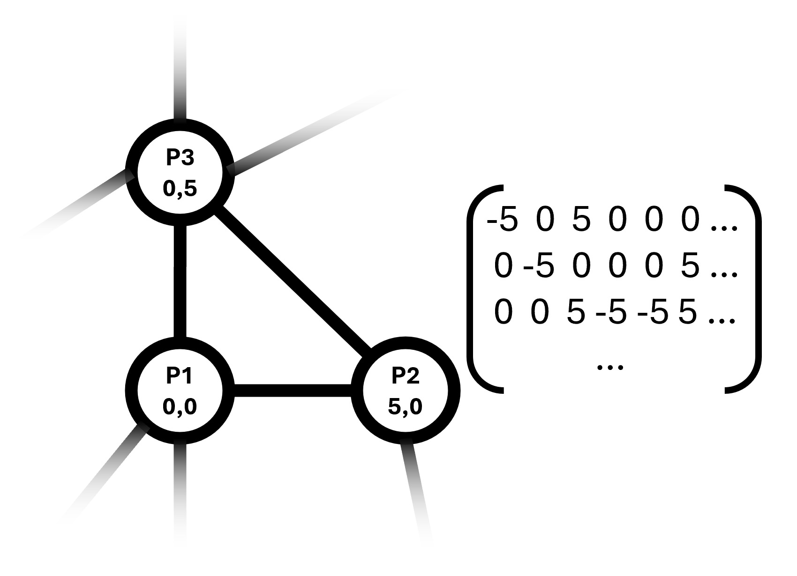
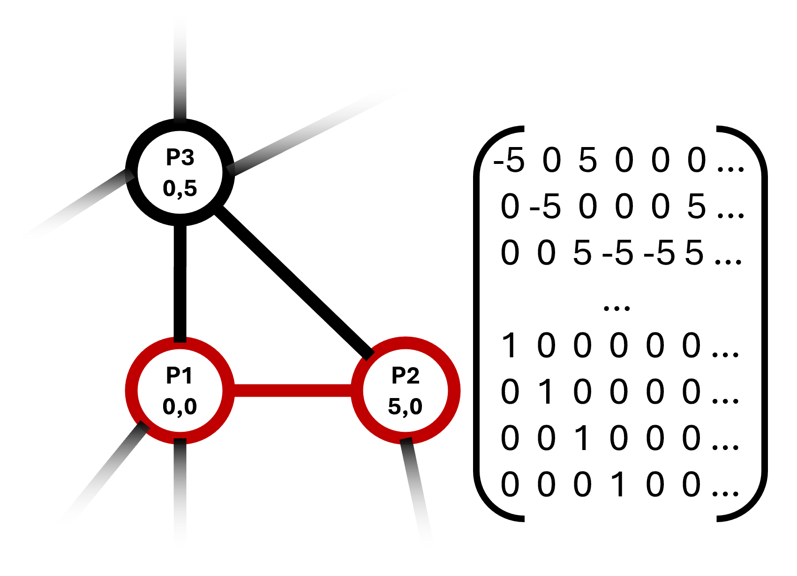
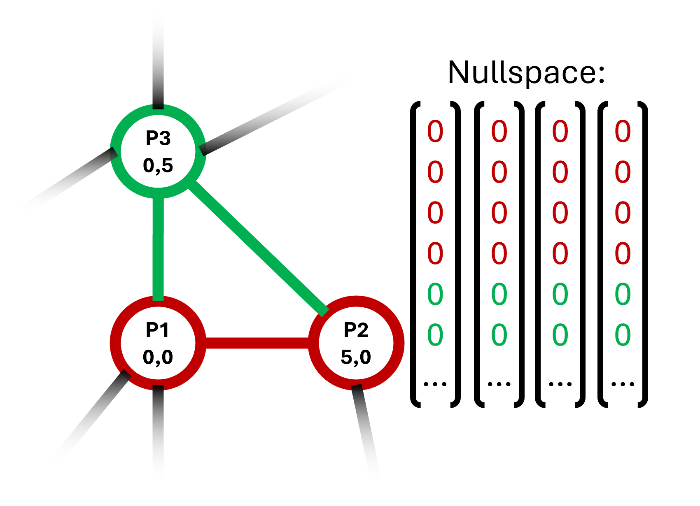
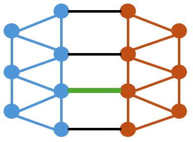

# Rigid Subgraphs
Python implementation of a method to find all maximum infinitesimal rigid subgraphs of 2 and 3 dimensional graphs.

## Finding maximum infinitesimal rigid subgraphs in 2D
*For simplicity, infinitesimal rigidity will be refered to as rigidity in the description of the algothims.*

In 2D, fixing two points in a rigid graph fixes the whole graph. Our algorithm exploits this property to find maximum rigid subgraphs:
Since any non-trivial rigid graph contains at least one edge, all maximum rigid subgraphs can be found by fixing a single edge and then detecting all points that can not move as a consequence.

To do that, we first create the rigidity matrix of the graph. To fix an edge, we set the possible movement of both points to 0 by adding a row for each dimension of the points.
We can then search through the nullspace of the matrix to find all points that have been fixed and add these to the subgraph. Since exactly the points that can not move relative to the edge are added, the found points form a maximum rigid subgraph.

By iterating through all edges while skipping those that are already in a maximum rigid subgraph, all maximum rigid subgraphs are found.

## Finding maximum infinitesimal rigid subgraphs in 3D
In 3D, fixing three points in a rigid graph fixes the whole graph, unless the three points are collinear. We use the same approach as in the 2D case, but use triangles as bases for the subgraphs instead of edges: We find a triangle, set the movement vectors of the points to 0 in the rigidity matrix and detect all fixed points in the nullspace. The resulting set of points defines a maximum rigid subgraph. Finally, we add all edges, that are not part of any subgraph, as 2-element-subgraphs.

Unfortunately, our research gave no conclusive information on wether or not a 3D rigid graph with at least 3 points always contains a triangle. Our algorithm would not be able to detect rigid subgraphs without triangles. To fix that, we added the parameter `assume_triangles`. If `assume_triangles` is `true` (default), the algorithm assumes that every rigid subgraph with at least 3 nodes contains a triangle. 

If `assume_triangles` is `false`, the algorithm does another pass over all sets of 3 points connected by 2 edges, that are not already in a common subgraph. To detect whether these points are part of a rigid subgraph, the missing edge is added to the rigidity matrix. We than compare the rank of the matrix with and without the additional edge. Since the rank is equivalent to the degrees of freedom of the graph, adding another edge should reduce the rank of the rigidity matrix, because it restricts the relative movement between two points. However, if all three points belong to a rigid subgraph, no relative movement is possible between the points, so the additional edge does not change the degrees of freedom. 

So if the rank stays the same, we know that the points belong to a rigid subgraph and can find the whole maximum rigid subgraph using the pinning method from before.

## Merging maximum infinitesimal rigid subgraphs
The method `merge_rigid_subgraphs` can be used to merge rigid subgraphs of a graph to maximum rigid subgraphs. To do that, it uses a similar approach to the second pass when finding maximum rigid subgraphs in 3D if `assume_triangles` is set to `false`: Additional edges are added between neighboring subgraphs. If these edges do not change the rank of the rigidity matrix (the degrees of freedom of the graph), the two subgraphs are merged. In particular, this method is able to generate maximum rigid subgraphs even if just the edges of the graph are given as rigid subgraphs, independent of the graphs's dimension. It is therefor more powerful than the two previously described algorithms. However, it is not recommended to use this method as the current implementation is highly inefficient.

## Future Work
A possible application for the implemented algorithms would be using them in an interactive tool that simulates movement of a 3D model, where the detection of rigid subgraphs allows treating rigid subgraphs as solid objects instead of simulating physics based on just the edges. If the model (and thereby the graph) are interactively changed in such a program, a common operation would be the extension of an existing graph with additional nodes and edges or the combination of two graphs. An extension or merge would result in new rigid subgraphs. 

Since these new rigid subgraphs would contain nodes local to the changes, there are more efficient ways of updating the rigid subgraphs than recomputing them all from ground up. On one hand, only these local nodes could be used to find rigid subgraphs through pinning, or the merging approach could be used to merge subgraphs starting from these nodes.

If the merging approach were to be used, it should be refined. The current implementation adds all missing edges to the matrix before computing the new rank, but in most cases one edge would be sufficient. However, there are configurations like the image below for the 2D-case, where a specific additional edge does not reduce the degrees of freedom. Detecting these cases would allow an optimization of the merging approach.

[Katz et al.](https://publikationen.bibliothek.kit.edu/1000005767) present a method to efficiently merge generically rigid subgraphs to maximum generically rigid subgraphs. If the configuration is not relevant or if this approach could be adapted for infinitesimal rigid subgraphs, the merging approach could be made more efficient.

### References
Katz, B., Gaertler, M., & Wagner, D. (2007). Maximum Rigid Components as Means for Direction-Based Localization in Sensor Networks. In J. van Leeuwen, G. F. Italiano, W. van der Hoek, C. Meinel, H. Sack, & F. Plášil (Eds.), SOFSEM 2007: Theory and Practice of Computer Science (pp. 330–341). Berlin, Heidelberg: Springer Berlin Heidelberg.
