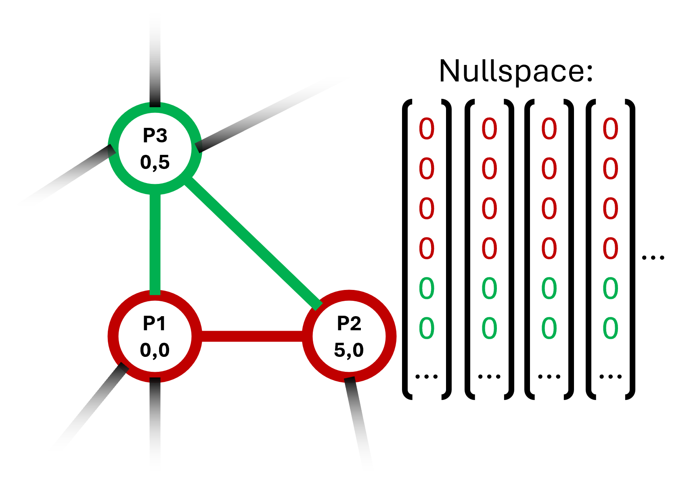

# Rigid Subgraphs
Python implementation of a method to find all maximum infinitesimal rigid subgraphs of 2 and 3 dimensional graphs.

## Finding maximum infinitesimal rigid subgraphs in 2D
*For simplicity, infinitesimal rigidity will be refered to as rigidity in the description of the algothims.*

In 2D, fixing two points in a rigid graph fixes the whole graph. Our algorithm exploits this property to find maximum rigid subgraphs:
Since any non-trivial rigid graph contains at least one edge, all maximum rigid subgraphs can be found by fixing a single edge and then detecting all points that can not move as a consequence.

To do that, we first create the rigidity matrix of the graph. To fix an edge, we set the possible movement of both points to 0 by adding a row for each dimension of the points.
We can then search through the nullspace of the matrix to find all points that have been fixed and add these to the subgraph. Since exactly the points that can not move relative to the edge are added, the found points form a maximum rigid subgraph.

By iterating through all edges while skipping those that are already in a maximum rigid subgraph, all maximum rigid subgraphs are found.

## Finding maximum infinitesimal rigid subgraphs in 3D
In 3D, fixing three points in a rigid graph fixes the whole graph, unless the three points are collinear. We use the same approach as in the 2D case, but use triangles as bases for the subgraphs instead of edges: We find a triangle, set the movement vectors of the points to 0 in the rigidity matrix and detect all fixed points in the nullspace. The resulting set of points defines a maximum rigid subgraph. Finally, we add all edges, that are not part of any subgraph, as 2-element-subgraphs.

Unfortunately, our research gave no conclusive information on wether or not a 3D rigid graph with at least 3 points always contains a triangle. Our algorithm would not be able to detect rigid subgraphs without triangles. To fix that, we added the parameter `assume_triangles`. If `assume_triangles` is `true` (default), the algorithm assumes that every rigid subgraph with at least 3 nodes contains a triangle. 

If `assume_triangles` is `false`, the algorithm does another pass over all sets of 3 points connected by 2 edges, that are not already in a common subgraph. To detect whether these points are part of a rigid subgraph, the missing edge is added to the rigidity matrix. We than compare the rank of the matrix with and without the additional edge. Since the rank is equivalent to the degrees of freedom of the graph, adding another edge should reduce the rank of the rigidity matrix, because it restricts the relative movement between two points. However, if all three points belong to a rigid subgraph, no relative movement is possible between the points, so the additional edge does not change the degrees of freedom. 

So if the rank stays the same, we know that the points belong to a rigid subgraph and can find the whole maximum rigid subgraph using the pinning method from before.
